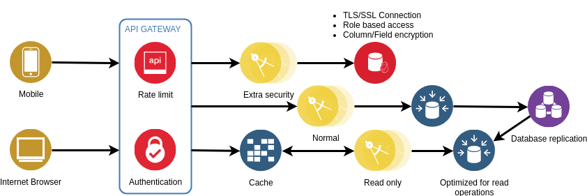

# vertx-postgres-sample

## Usage
You need to have installed docker and docker-compose.
- Edit the `.env` file to fit your setup;
- Issue the following command: `docker-compose up` in the root directory of this project.

## Solution

## Technologies
- Java
- PostgreSQL

## API
The OpenAPI documentation can be found here: [api](https://app.swaggerhub.com/apis-docs/n286/vertx-postgres-sample/1.0.0)

## Other info
I would change the following:
- Database B needs to have CPF.
